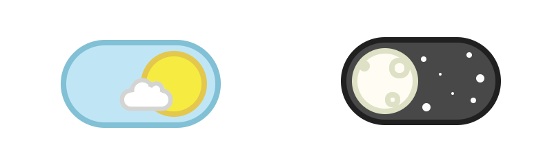

# react-daynite-toggle
A quick component build out to mock a dribbble UI toggle design. Compare with the original [Here](https://dribbble.com/shots/1909289-Day-Night-Toggle-Button-GIF) and see the final side-by-side comparison [Here](http://tjtc.me/react-daynite-toggle/)

#### Built with:
  * CSS & HTML
  * React
  * Webpack

#### Outcome

### Setup & Build
  * `npm i` - install it!
  * `npm run dev` - build it!
